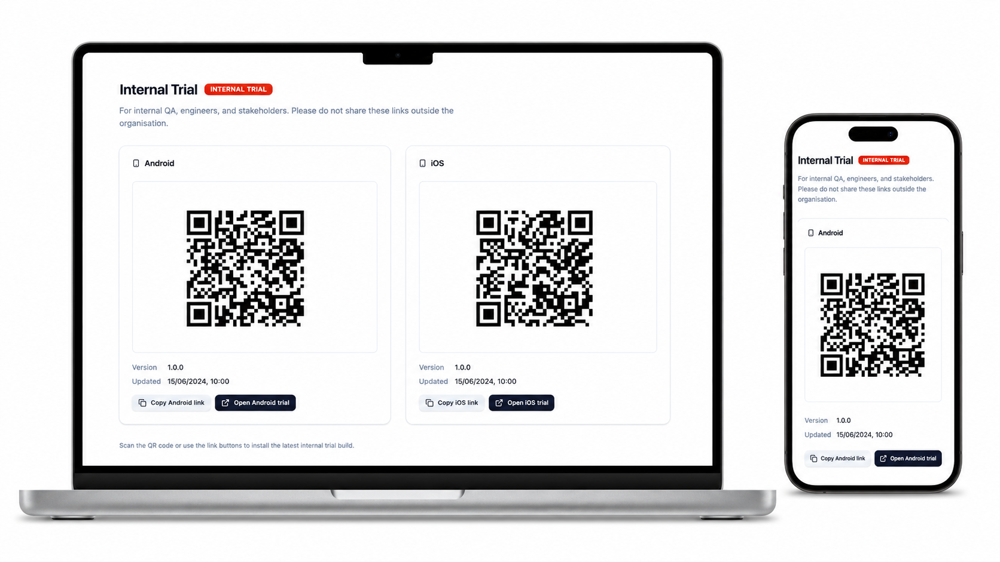
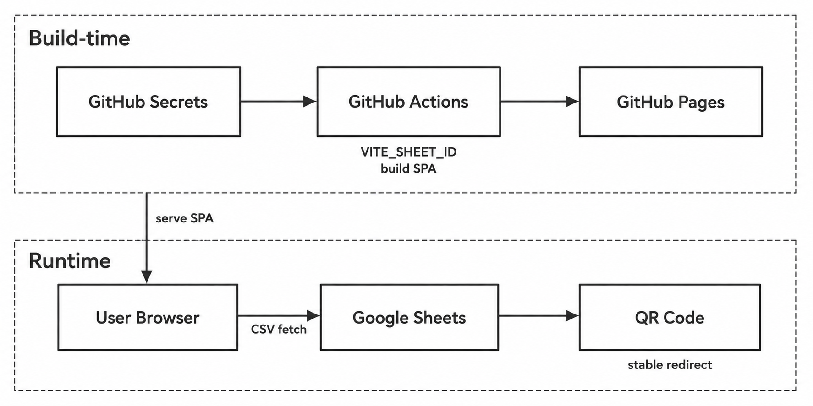

# mobileapp-beta



Static SPA that generates QR codes for mobile app trial distribution. Trial link data (target URLs, versions, dates) is pulled at runtime from a public Google Sheet via CSV export. QR codes encode stable redirect paths that resolve to the latest build URL from the sheet.



## Stack

Vite + React 19 + TanStack Router + Tailwind CSS v4. Deployed to GitHub Pages.

## Data source

Google Sheets document exported as CSV:
```
https://docs.google.com/spreadsheets/d/{SHEET_ID}/export?format=csv&gid={GID}
```

The sheet ID is injected at build time via `VITE_SHEET_ID` — it is never committed to source.

### Setting up the Google Sheet

1. Open Google Sheets and create a new spreadsheet.
2. Import [`template.csv`](template.csv) (File → Import → Upload → Replace current sheet).
3. Replace the example URLs with your actual TestFlight / Play Store testing links.
4. Set sharing to **"Anyone with the link" → Viewer**.
5. Copy the sheet ID from the URL: `https://docs.google.com/spreadsheets/d/{THIS_PART}/edit`
6. Add it as your `SHEET_ID` GitHub Secret and in your local `.env`.

### Required columns

| Column | Description | Example values |
|---|---|---|
| `target_url` | Trial mode identifier | `internal_beta`, `external_beta` |
| `build_id` | Platform | `android`, `ios` |
| `variable_url` | Current download/install URL | TestFlight or Play Store link |
| `updated_date` | Last updated date (M/D/YYYY) | `6/15/2024` |
| `version_build` | Build version string | `1.2.0` |

## Environment variables

| Variable | Description |
|---|---|
| `VITE_SHEET_ID` | Google Sheets document ID |
| `VITE_SHEET_GID` | Sheet tab GID (default `0`) |

Copy the example env file for local development:

```sh
cp .env.example .env
```

Then fill in your actual sheet ID.

## Dev

```sh
bun install
bun run dev
```

## Secrets & deployment

The app deploys to GitHub Pages via Actions on push to `main`.

### Required GitHub Secrets

Go to **Settings → Secrets and variables → Actions → New repository secret** and add:

| Secret | Value |
|---|---|
| `SHEET_ID` | Your Google Sheets document ID |
| `SHEET_GID` | Sheet tab GID (typically `0`) |

These are passed to the Vite build as `VITE_SHEET_ID` and `VITE_SHEET_GID` in the workflow, then baked into the client bundle at compile time.

### Manual build

```sh
bun run build  # outputs to dist/
```

`base` in `vite.config.ts` must match the repo name for GitHub Pages subpath routing.
